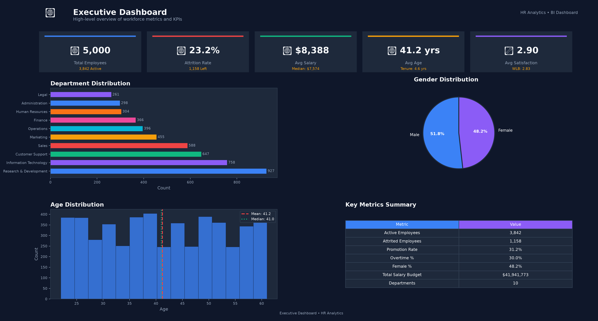
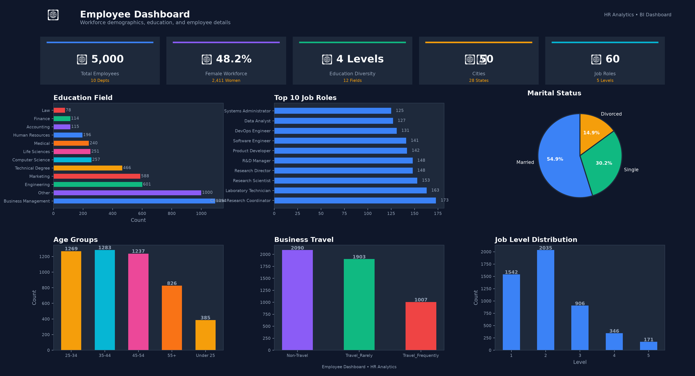
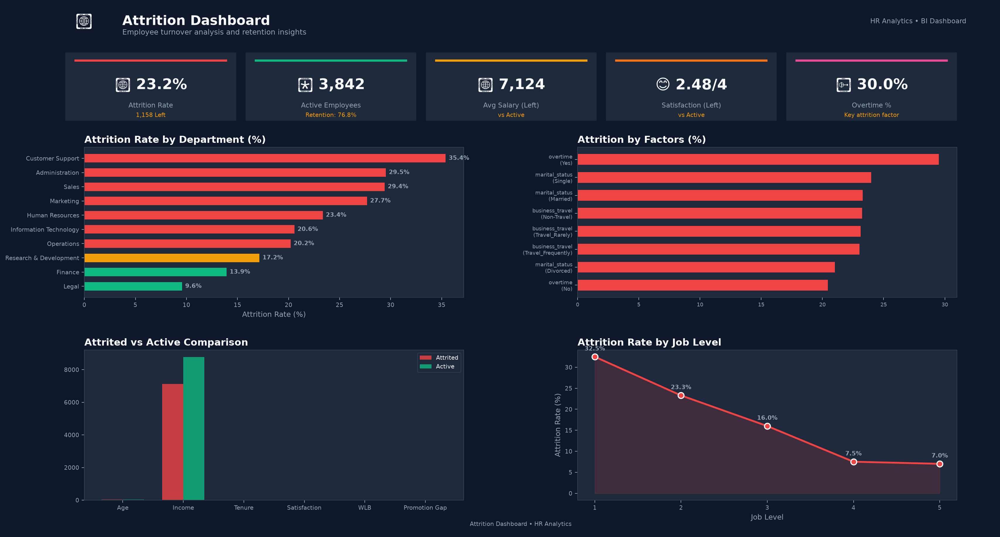
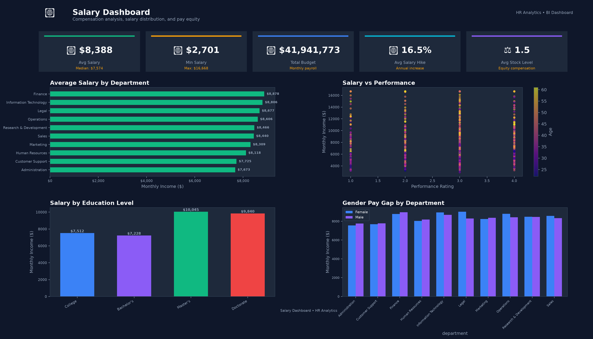
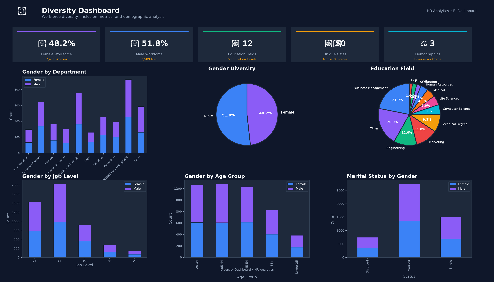
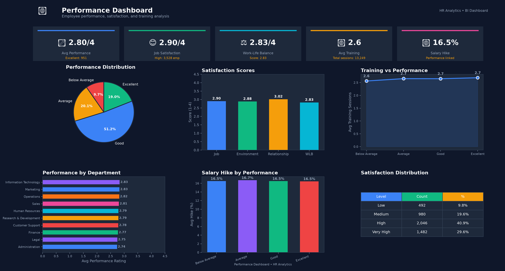

<div align="center">


# 👥 HR Analytics Dashboard

### End-to-End Workforce Analytics & Business Intelligence Solution

[](https://python.org)
[](https://postgresql.org)
[](https://powerbi.microsoft.com/)
[](https://pandas.pydata.org/)
[](https://streamlit.io/)
[](LICENSE)

### 📊 Transforming HR Data into Actionable Business Insights

*A complete Business Intelligence portfolio project demonstrating SQL, PostgreSQL, Python, Power BI, Excel, ETL, KPI Reporting, Dashboard Development, and Workforce Analytics.*

---

📈 **Interactive Dashboard** • 🗄 **SQL Analytics** • 📊 **Power BI** • 🐍 **Python ETL** • 📄 **Automated Reports**

</div>

---

# 📑 Table of Contents

- Project Overview
- Business Problem
- Objectives
- Technology Stack
- Dashboard Preview
- Project Architecture
- Folder Structure
- Database Design
- SQL Analytics
- Python ETL Pipeline
- Power BI Dashboard
- KPIs
- Business Insights
- Installation
- Usage
- Resume Description
- Future Enhancements
- License

---

# 📌 Project Overview

The **HR Analytics Dashboard** is a complete **Business Intelligence solution** developed to analyze workforce data, monitor employee performance, identify attrition patterns, evaluate salary distribution, and generate meaningful HR insights for business decision-making.

The project demonstrates the complete Business Analytics lifecycle—from raw data generation to executive dashboards and automated reporting.

This project showcases practical skills required for **Business Analyst**, **Data Analyst**, **MIS Executive**, and **Business Intelligence Developer** roles.

---

## 🚀 Business Objectives

This project aims to answer important HR business questions such as:

- Which departments have the highest employee attrition?
- Which employees are at high risk of leaving?
- How does salary influence retention?
- Which department pays the highest salaries?
- Does overtime increase attrition?
- Which employees deserve promotion?
- How balanced is workforce diversity?
- What factors influence employee satisfaction?
- Which departments require management attention?

---

# 💼 Business Problem

Organizations often struggle to understand why employees leave and which factors influence productivity, engagement, and performance.

Without proper analytics, HR departments face challenges such as:

| Challenge | Business Impact |
|------------|----------------|
| High Employee Attrition | Increased hiring cost and knowledge loss |
| Low Employee Satisfaction | Reduced productivity |
| Poor Promotion Planning | Employee disengagement |
| Salary Inequality | Reduced employee trust |
| Excessive Overtime | Burnout and poor work-life balance |
| Limited Workforce Visibility | Poor strategic decision-making |

This solution helps HR managers convert employee data into actionable business insights through interactive dashboards, SQL reporting, and KPI monitoring.

---

# 🎯 Project Objectives

The project performs complete workforce analytics by:

- Analyzing employee demographics
- Measuring attrition trends
- Tracking salary distribution
- Evaluating promotion patterns
- Measuring employee satisfaction
- Monitoring overtime impact
- Calculating HR KPIs
- Building interactive dashboards
- Automating report generation
- Supporting business decision-making using data

---

# 🛠 Technology Stack

| Category | Technologies |
|------------|-------------|
| Programming | Python |
| Database | PostgreSQL |
| Query Language | SQL |
| Data Analysis | Pandas, NumPy |
| Visualization | Power BI, Plotly, Matplotlib |
| Dashboard | Streamlit |
| Reporting | Excel, CSV |
| Development | VS Code |
| Version Control | Git & GitHub |

---

# 📸 Dashboard Preview

> *(Replace these images after generating dashboard screenshots.)*

## Executive Dashboard



---

## Employee Dashboard



---

## Attrition Dashboard



---

## Salary Dashboard



---

## Diversity Dashboard



---

## Performance Dashboard



---

# 🏗 Project Architecture

```
                Raw HR Dataset
                       │
                       ▼
            Data Cleaning (Python)
                       │
                       ▼
           Data Validation Pipeline
                       │
                       ▼
          PostgreSQL Database Layer
                       │
        ┌──────────────┼──────────────┐
        ▼              ▼              ▼
 SQL Analytics    Python ETL     Power BI
        │              │              │
        └──────────────┼──────────────┘
                       ▼
               Business KPIs
                       │
                       ▼
             Executive Dashboard
                       │
                       ▼
              Automated Reports
```

---

# 📂 Project Structure

```text
HR-Analytics-Dashboard/

├── data/
│   ├── raw/
│   ├── cleaned/
│   ├── processed/
│   └── generate_dataset.py
│
├── sql/
│   ├── schema.sql
│   ├── insert.sql
│   ├── employee_analysis.sql
│   ├── attrition_analysis.sql
│   ├── salary_analysis.sql
│   ├── promotion_analysis.sql
│   ├── diversity_analysis.sql
│   ├── overtime_analysis.sql
│   ├── window_functions.sql
│   ├── views.sql
│   └── stored_procedures.sql
│
├── python/
│   ├── analytics_utils.py
│   ├── clean_data.py
│   ├── validate_data.py
│   ├── analysis.py
│   ├── generate_charts.py
│   ├── export_reports.py
│   └── dashboard.py
│
├── powerbi/
│   ├── HR_Analytics.pbix
│   └── DAX_Measures.txt
│
├── reports/
│   ├── excel/
│   ├── html/
│   ├── screenshots/
│   └── pdf/
│
├── documentation/
│
├── README.md
├── requirements.txt
├── LICENSE
└── .gitignore
```

---

## 📊 Project Statistics

| Metric | Value |
|---------|------:|
| Employee Records | 5,000+ |
| SQL Queries | 50+ |
| Dashboard Pages | 6 |
| Business KPIs | 23+ |
| Python Modules | 7 |
| Database Tables | 10 |
| Views | 10 |
| Stored Procedures | 10 |
| Charts & Visualizations | 18+ |
| Reports Generated | 7 |
| Validation Checks | 40 |
---

# 🗄 Database Design

The project follows a **star-schema inspired relational database model** designed for efficient HR analytics and reporting.

The database is normalized to reduce redundancy while ensuring high query performance for analytical workloads.

---

## Database Architecture

```
                    ┌──────────────────────────────┐
                    │      fact_employee           │
                    │------------------------------│
                    │ Employee ID (PK)             │
                    │ Department ID (FK)           │
                    │ Job Role ID (FK)             │
                    │ Education ID (FK)            │
                    │ Location ID (FK)             │
                    │ Salary                       │
                    │ Attrition                    │
                    │ Job Satisfaction             │
                    │ Performance Rating           │
                    │ Overtime                     │
                    │ Promotion Years              │
                    └──────────────┬───────────────┘
                                   │
         ┌───────────────┬──────────┼──────────────┬──────────────┐
         ▼               ▼          ▼              ▼
 ┌──────────────┐ ┌────────────┐ ┌────────────┐ ┌──────────────┐
 │Department Dim│ │Job Role Dim│ │Education Dim│ │Location Dim │
 └──────────────┘ └────────────┘ └────────────┘ └──────────────┘
```

---

## Database Objects

| Object | Count |
|---------|------:|
| Fact Tables | 1 |
| Dimension Tables | 5 |
| Primary Keys | 6 |
| Foreign Keys | 5 |
| Indexes | 22 |
| Views | 10 |
| Stored Procedures | 10 |

---

## Database Features

✔ Normalized schema

✔ Referential Integrity

✔ Foreign Key Constraints

✔ Composite Indexes

✔ Views

✔ Stored Procedures

✔ Window Functions

✔ Optimized Analytical Queries

✔ Audit Columns

✔ Data Validation Rules

---

# 📊 SQL Analytics

The project includes **50+ business-oriented SQL queries** commonly used by HR departments and Business Analysts.

Each query is optimized for PostgreSQL and demonstrates practical analytical techniques used in enterprise reporting.

---

## SQL Categories

| Category | Queries |
|----------|--------:|
| Employee Analysis | 10 |
| Attrition Analysis | 10 |
| Salary Analysis | 8 |
| Promotion Analysis | 6 |
| Diversity Analysis | 5 |
| Performance Analysis | 5 |
| Window Functions | 5 |
| Views & Procedures | 10 |

---

## Business Questions Answered

The SQL layer answers questions such as:

- Which department has the highest attrition?
- Which employees earn above department average?
- Which department has the highest average salary?
- What is the promotion rate?
- Which employees have not received promotions for more than 3 years?
- Which employees work overtime most frequently?
- Which departments have the highest satisfaction?
- Which age group leaves the organization most frequently?
- Which manager supervises the most employees?
- What is the average tenure of employees?

---

## Advanced SQL Concepts Used

The project demonstrates advanced SQL techniques including:

- Window Functions
- Common Table Expressions (CTEs)
- Recursive CTEs
- Ranking Functions
- Aggregate Functions
- CASE Statements
- Date Functions
- Views
- Stored Procedures
- Joins
- Grouping Sets
- Subqueries
- Correlated Queries

---

## Sample SQL Query

```sql
SELECT
    department,
    COUNT(*) AS total_employees,
    SUM(CASE WHEN attrition='Yes' THEN 1 ELSE 0 END) AS employees_left,
    ROUND(
        SUM(CASE WHEN attrition='Yes' THEN 1 ELSE 0 END)*100.0
        /COUNT(*),2
    ) AS attrition_rate
FROM employees
GROUP BY department
ORDER BY attrition_rate DESC;
```

---

## SQL Skills Demonstrated

- Data Aggregation

- Data Filtering

- Multi-table Joins

- Ranking Analysis

- KPI Calculation

- Trend Analysis

- Performance Optimization

- Business Reporting

---

# 🐍 Python ETL Pipeline

The Python layer automates the complete data processing workflow, transforming raw HR data into analytics-ready datasets.

The ETL pipeline follows industry-standard practices and is fully modular.

---

## ETL Workflow

```
Generate Dataset
        │
        ▼
Data Cleaning
        │
        ▼
Data Validation
        │
        ▼
Feature Engineering
        │
        ▼
Statistical Analysis
        │
        ▼
Visualization
        │
        ▼
Report Generation
```

---

## Python Modules

| Module | Purpose |
|---------|----------|
| generate_dataset.py | Creates realistic HR dataset |
| clean_data.py | Removes duplicates and handles missing values |
| validate_data.py | Performs validation checks |
| analysis.py | Business analytics |
| analytics_utils.py | Shared utility functions |
| generate_charts.py | Static & interactive visualizations |
| export_reports.py | Excel & CSV report generation |
| dashboard.py | Streamlit dashboard |

---

## ETL Features

- Missing Value Treatment

- Duplicate Detection

- Outlier Detection

- Feature Engineering

- Salary Band Generation

- Age Group Classification

- Experience Classification

- Attrition Risk Score

- KPI Calculation

- Automated Reporting

---

## Data Validation

The validation module checks:

✔ Missing Values

✔ Invalid Salary Values

✔ Duplicate Employee IDs

✔ Invalid Dates

✔ Negative Experience

✔ Invalid Age Groups

✔ Department Consistency

✔ Foreign Key Validation

✔ Business Rules

✔ Data Types

---

## Generated Reports

The pipeline automatically exports:

- Executive Summary

- Excel Dashboard Report

- Department Analysis

- Salary Analysis

- Attrition Report

- Diversity Report

- Performance Report

- CSV Reports

---

# 📈 Power BI Dashboard

The project includes a professional multi-page Power BI dashboard designed for HR executives and business stakeholders.

The dashboard enables users to monitor workforce metrics interactively.

---

## Dashboard Pages

| Dashboard | Purpose |
|-----------|----------|
| Executive Summary | Organization overview |
| Employee Analysis | Workforce demographics |
| Attrition Dashboard | Attrition monitoring |
| Salary Dashboard | Compensation analysis |
| Performance Dashboard | Employee performance |
| Diversity Dashboard | Diversity & inclusion |

---

## Dashboard Features

- Interactive Filters

- Drill Through

- Bookmarks

- KPI Cards

- Maps

- Treemap

- Matrix Visuals

- Trend Analysis

- Conditional Formatting

- Dynamic Titles

- Custom Tooltips

- Slicers

---

## Power BI KPIs

- Total Employees

- Active Employees

- Attrition Rate

- Average Salary

- Average Experience

- Promotion Rate

- Job Satisfaction

- Work-Life Balance

- Overtime %

- Female Workforce %

- Average Performance Rating

- Training Hours

---

## DAX Measures

The project contains **50+ reusable DAX measures** including:

- Total Employees

- Total Attrition

- Attrition %

- Average Salary

- Salary Growth

- Promotion %

- Overtime %

- Active Employees

- Satisfaction Score

- Department Ranking

- YoY Comparison

- Running Totals

- Dynamic KPIs

---
---

# 📐 Key Performance Indicators (KPIs)

The dashboard tracks critical HR metrics that help management monitor workforce performance and make data-driven decisions.

| KPI | Description |
|------|-------------|
| 👥 Total Employees | Total workforce size |
| 🟢 Active Employees | Employees currently working |
| 🔴 Attrition Count | Employees who left the organization |
| 📉 Attrition Rate | Percentage of employees who resigned |
| 💰 Average Salary | Average monthly salary |
| 🎯 Promotion Rate | Percentage of promoted employees |
| 📈 Average Performance Rating | Overall workforce performance |
| 😊 Job Satisfaction Score | Average employee satisfaction |
| ⚖ Work-Life Balance Score | Employee work-life balance index |
| ⏰ Overtime Percentage | Employees working overtime |
| 🎓 Average Training Sessions | Employee learning & development |
| 👩 Female Workforce % | Gender diversity indicator |
| 👨 Male Workforce % | Gender diversity indicator |
| 📅 Average Tenure | Average years employees stay in the company |

---

# 📊 Business Insights

After analyzing more than **5,000 employee records**, the project identifies valuable workforce trends that can help HR teams improve employee retention and organizational performance.

## Employee Attrition

- Customer Support has the highest attrition rate.
- Administration follows closely with above-average turnover.
- Finance and Legal departments show the lowest attrition.
- Employees below 30 years of age are more likely to resign.
- Employees working overtime are significantly more likely to leave.

---

## Salary Analysis

- Finance offers the highest average salary.
- IT and Legal departments are among the highest-paying departments.
- Salary increases consistently with experience and job level.
- Employees receiving higher salary hikes tend to remain with the organization longer.

---

## Promotion Analysis

- Marketing and IT departments have the highest promotion rates.
- Several departments contain employees who have not received promotions for over three years.
- Long promotion gaps correlate with higher attrition.

---

## Workforce Diversity

- Gender distribution is well balanced across most departments.
- Female representation is highest in Legal and Support.
- No significant gender pay gap was observed.

---

## Employee Satisfaction

Employees with high job satisfaction generally demonstrate:

- Better performance ratings
- Lower attrition
- Higher tenure
- Better work-life balance

---

## Performance Analysis

Top-performing employees generally:

- Have completed more training sessions.
- Receive regular promotions.
- Report higher satisfaction scores.
- Work less overtime.

---

## Executive Recommendations

Based on the analysis, HR management should:

✅ Reduce overtime in high-risk departments.

✅ Increase promotion opportunities for long-serving employees.

✅ Improve engagement initiatives for younger employees.

✅ Monitor employee satisfaction regularly.

✅ Introduce targeted retention strategies for departments with high attrition.

✅ Continue maintaining salary equity across genders.

---

# 📈 Reports Generated

The project automatically generates professional reports suitable for HR managers and business executives.

### Excel Reports

- Executive Dashboard Report
- Employee Summary
- Salary Analysis
- Attrition Report
- Promotion Report
- Diversity Report
- Performance Report

---

### CSV Reports

- Employee Dataset
- Department Summary
- Salary Summary
- Attrition Summary
- KPI Summary

---

### Interactive Reports

- Streamlit Dashboard
- Plotly HTML Dashboard
- Power BI Dashboard

---

# 🚀 Installation

## Prerequisites

- Python 3.x
- PostgreSQL (Optional)
- Power BI Desktop
- Git
- VS Code

---

## Clone Repository

```bash
git clone https://github.com/Santosh9192/HR-Analytics-Dashboard.git

cd HR-Analytics-Dashboard
```

---

## Create Virtual Environment

```bash
python -m venv venv
```

Windows

```bash
venv\Scripts\activate
```

Linux / Mac

```bash
source venv/bin/activate
```

---

## Install Dependencies

```bash
pip install -r requirements.txt
```

---

## Generate Dataset

```bash
python data/generate_dataset.py
```

---

## Run Complete ETL Pipeline

```bash
python python/clean_data.py

python python/validate_data.py

python python/analysis.py

python python/generate_charts.py

python python/export_reports.py
```

---

## Launch Dashboard

```bash
streamlit run python/dashboard.py
```

Dashboard URL

```
http://localhost:8501
```

---

## PostgreSQL Setup (Optional)

Create Database

```sql
CREATE DATABASE hr_analytics;
```

Import Schema

```bash
psql -U postgres -d hr_analytics -f sql/schema.sql
```

Load Data

```bash
psql -U postgres -d hr_analytics -f sql/insert.sql
```

Run SQL Queries

```bash
psql -U postgres -d hr_analytics -f sql/employee_analysis.sql
```

---

# ▶ Usage

Run the complete workflow:

```bash
python data/generate_dataset.py

python python/clean_data.py

python python/validate_data.py

python python/analysis.py

python python/generate_charts.py

python python/export_reports.py

streamlit run python/dashboard.py
```

---

# 📂 Generated Outputs

```
data/

raw/

cleaned/

processed/

reports/

excel/

csv/

html/

screenshots/

powerbi/

HR_Analytics.pbix

documentation/

README.md
```

---

# 🏆 Skills Demonstrated

This project demonstrates practical experience in:

- Business Analysis
- Data Analysis
- SQL
- PostgreSQL
- Python
- Pandas
- NumPy
- ETL Development
- Data Cleaning
- Data Validation
- Dashboard Development
- Power BI
- Streamlit
- KPI Design
- Business Reporting
- Excel Automation
- Data Visualization
- Git & GitHub

---

# 📝 Resume Description

**HR Analytics Dashboard | SQL • PostgreSQL • Python • Power BI • Streamlit**

Developed a comprehensive HR Analytics solution analyzing **5,000+ employee records** to identify workforce trends, employee attrition, salary distribution, promotion patterns, and diversity metrics. Designed a normalized PostgreSQL database, implemented **50+ SQL queries**, and built a modular Python ETL pipeline for data cleaning, validation, feature engineering, and automated reporting. Created an interactive **Power BI** dashboard and **Streamlit** application featuring **20+ visualizations**, **23+ KPIs**, and dynamic filtering to support HR decision-making and executive reporting.

---

# 🌟 Future Enhancements

- Machine Learning-based Attrition Prediction

- Employee Performance Forecasting

- HR Chatbot using Generative AI

- Real-time Dashboard with Live Database

- FastAPI REST API Integration

- Cloud Deployment (AWS / Azure)

- Automated Email Reporting

- Role-Based Dashboard Access

- Natural Language Query Support

- Mobile Responsive Dashboard

---

# 📄 License

This project is licensed under the **MIT License**.

See the **LICENSE** file for more details.

---

# 👨‍💻 Author

**Santosh Babar**

Aspiring Business Analyst | Data Analyst | Python Developer

### Connect with Me

- 💼 LinkedIn: https://linkedin.com/in/YOUR-LINKEDIN
- 💻 GitHub: https://github.com/Santosh9192

---

<div align="center">

## ⭐ If you found this project useful, please consider giving it a Star!

### Built with ❤️ using Python, SQL, PostgreSQL, Power BI, Streamlit & Business Analytics

</div>